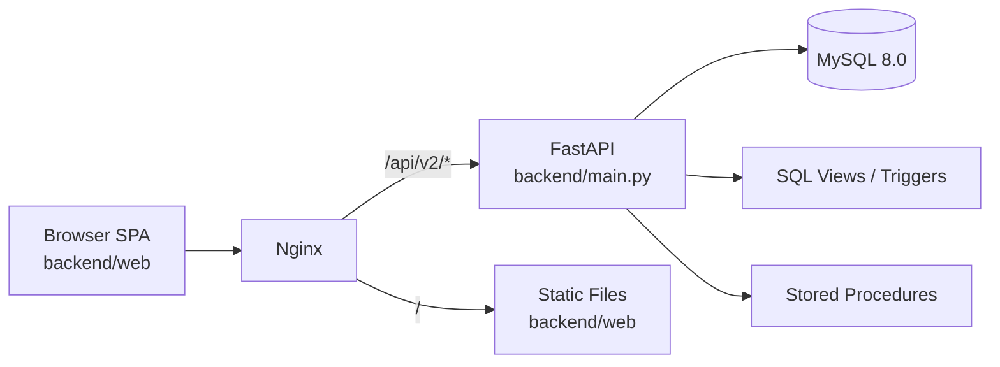

# Fixture-M Architecture

## 1. 目的與範圍

本文件描述 `Fixture-M` 目前程式碼實作對應的系統架構（非理想化設計），涵蓋：

- 執行時元件與部署拓樸
- 後端分層與主要 API domain
- 前端模組化結構與 API 互動方式
- 資料庫表/檢視/觸發器角色分工
- 目前架構風險與演進建議

---

## 2. 系統總覽

`Fixture-M` 是治具生命週期管理系統，核心流程包含：

- 基礎主檔：客戶、治具、機種、站點、負責人
- 庫存交易：收料 / 退料（序號與 datecode）
- 使用與更換：usage logs / replacement logs
- 壽命分析：lifecycle 與 dashboard analytics

### 2.1 高階元件圖



---

## 3. 執行與部署架構

### 3.1 Docker Compose 拓樸

`docker-compose.yml` 目前定義三個服務：

- `db`: MySQL 8.0（port `3307:3306`）
- `web`: FastAPI/Uvicorn（port `8000:8000`）
- `nginx`: Reverse proxy + static host（port `80`, `443`）

共用網路：`fixture_network`  
持久化 volume：`mysql_data`, `upload_data`, `nginx_logs`

### 3.2 Nginx 路由責任

`nginx.conf` 主要規則：

- `/api/v2/` 反向代理到 `web:8000/api/v2/`
- `/docs`, `/redoc`, `/openapi.json` 代理到 FastAPI
- `/` 由 Nginx 直接提供前端靜態檔案（含 SPA fallback 到 `index.html`）
- `/health` 為 Nginx 自身健康檢查端點

---

## 4. 後端架構（FastAPI）

### 4.1 啟動入口

入口：`backend/main.py`

- 建立 FastAPI app、OpenAPI docs、CORS middleware
- 註冊全域 validation error handler
- 在 lifespan 內做 DB 連線檢查與關閉
- 所有業務 API 統一掛在 `/api/v2`

### 4.2 分層模型（實際實作）

```text
Routers (app/routers/*.py)
  -> 依賴注入 (dependencies.py)
  -> 認證工具 (auth.py)
  -> 資料存取 (database.py)
  -> MySQL（表 + View + Trigger + SP）
```

目前專案偏向「Router 內直接寫 SQL」風格，尚未拆出 service/repository layer。

### 4.3 核心模組

- `backend/config.py`
  - 載入環境變數，建立 `settings`
  - 管理 DB/JWT/上傳目錄等設定
- `backend/app/auth.py`
  - JWT 產生/驗證、token payload 解析、使用者啟用檢查
- `backend/app/dependencies.py`
  - `get_current_user` / `get_current_admin`
  - 從 `X-Customer-Id` 取得 customer context
- `backend/app/database.py`
  - `DBUtils.PooledDB + PyMySQL` 連線池
  - `execute_query / execute_one / execute_update / execute_insert`
  - `call_sp_with_out`（SP + OUT 參數）

### 4.4 API Domain（已在 `main.py` 註冊）

- 認證與帳號：`/auth`, `/users`, `/customers`
- 主檔：`/owners`, `/stations`, `/models`, `/model-detail`, `/fixtures`
- 庫存與交易：`/inventory`, `/serials`, `/transactions`（多個 router 共用）
- 使用與更換：`/usage`, `/replacement`
- 匯入：`fixtures_import`, `machine_models_import`, `transactions_import`（掛在既有 prefix）
- 分析：`/stats`, `/lifecycle`, `/lifecycle-analysis`

補充：`receipts.py`, `returns.py`, `model_run.py` 存在於程式碼中，但目前未在 `main.py` 註冊。

---

## 5. 前端架構（Static SPA）

前端檔案位於 `backend/web`，為傳統多檔 JS 模組：

- `index.html`: 單頁 UI 殼層 + script 載入順序
- `js/app/*`: 畫面流程與頁籤路由（hash router）
- `js/api/*`: 每個業務域 API 呼叫封裝
- `js/shared/*`、`js/utils/*`: 共用工具

### 5.1 API 呼叫規範

`js/api/api-config.js` 提供統一 `api()`：

- 預設 API 前綴：`/api/v2`
- 自動帶入 `Authorization: Bearer <token>`
- 自動帶入 `X-Customer-Id`（`window.currentCustomerId`）
- 統一錯誤格式處理

### 5.2 客戶上下文（Multi-tenant Context）

`js/app/customer-context.js` 負責：

- 依登入者可用客戶清單決定目前 customer
- 維護 `current_customer_id` 到 localStorage
- 切換客戶後刷新 active 模組資料

---

## 6. 資料架構（MySQL）

Schema: `database/init_database.sql`

### 6.1 主要實體表（節錄）

- 身分與租戶：`users`, `customers`, `user_customers`
- 主檔：`fixtures`, `machine_models`, `stations`, `owners`
- 關聯：`model_stations`, `fixture_requirements`, `fixture_deployments`
- 交易：`material_transactions`, `material_transaction_items`, `fixture_datecode_transactions`
- 庫存明細：`fixture_serials`, `fixture_datecode_inventory`
- 記錄：`usage_logs`, `replacement_logs`, `deployment_history`
- 摘要：`fixture_usage_summary`, `serial_usage_summary`, `inventory_snapshots`
- 稽核：`fixtures_history`, `fixture_serials_history`, `trigger_error_logs`

### 6.2 檢視（View）驅動查詢

系統大量讀取 View 作為查詢 API 資料來源，例如：

- 庫存/交易：`v_inventory_history`, `v_material_transactions_event`, `view_material_transaction_details`
- 狀態：`view_fixture_status`, `view_serial_status`
- 壽命：`view_lifecycle_status_v1`, `view_lifecycle_status_v2`, `view_upcoming_fixture_replacements`
- 偵錯：`v_recent_trigger_errors`

### 6.3 Trigger 與資料一致性

Schema 內含多個 trigger，用於：

- serial/datecode 狀態合法性檢查
- fixture lifecycle mode 防呆
- material transaction 禁止 update/delete
- audit 歷史追蹤與錯誤記錄

---

## 7. 關鍵資料流

### 7.1 認證與授權流

1. 前端呼叫 `/api/v2/auth/login` 取得 JWT  
2. 後續請求帶 `Authorization`  
3. `dependencies.get_current_user` 驗 token 並回查 `users`  
4. 需租戶資料之 API 另要求 `X-Customer-Id`  

### 7.2 交易寫入流（收/退料）

1. API 驗證 payload（record type、serial/datecode）  
2. Router 呼叫 MySQL Stored Procedure（`sp_material_receipt_v6` 或 `sp_material_return_v6`）  
3. DB 層/trigger 維持 serial 與庫存狀態一致性  
4. 查詢端由 View 聚合供前端顯示  

### 7.3 使用記錄流（usage）

1. API 檢查 fixture lifecycle/cycle unit  
2. 透過 `sp_insert_usage_log_v6` 寫入  
3. 刪除時走 `sp_delete_usage_log_v6`  
4. summary 表/壽命視圖供 dashboard 與 lifecycle API 讀取  

---

## 8. 架構風險與技術債（現況）

- `backend/app/routers/users.py` 使用 `db.insert(...)`，但 `database.py` 只有 `execute_insert(...)`，此處有執行時風險。
- 多個 router 共用 `/transactions` prefix，需靠路徑規則避免衝突，後續維護成本較高。
- `database/init_database.sql` 內可見大量 trigger 與 view，但未包含程式依賴的 SP 定義（如 `sp_material_receipt_v6`、`sp_insert_usage_log_v6`），部署需額外補齊。
- CORS 現為 `*`，僅適合內網/開發環境。
- 業務規則大量位於 SQL 與 router，跨層耦合高，單元測試與重構難度較高。

---

## 9. 建議演進方向

- 補齊 DB migration 策略（含 SP/Trigger/View 版本化），避免環境差異。
- 導入 service 層，將 router 與 SQL/business rule 解耦。
- 將 `/transactions` 巨型 domain 進一步拆分（query/write/import/report）。
- 補自動化測試（至少 auth、transaction、usage、lifecycle 四條主流程）。
- 生產環境收斂 CORS、secret 管理與觀測（request id、structured log、error tracing）。

